# NAT: The Invisible Translator Running the Internet

**Network Address Translation - what it is, why it exists, and why you should care.**

---

I've spent the better part of two decades designing and troubleshooting enterprise networks, and if there's one technology that engineers consistently underestimate, it's NAT. It's one of those things that "just works" - until it doesn't, and then suddenly you're staring at packet captures at 2 AM wondering why your WebRTC calls are failing or your application can't reach an external API.

Let's fix that. This article is the NAT deep-dive I wish someone had handed me when I was starting out.

---

## Why NAT Exists At All

The story of NAT is fundamentally a story about scarcity.

IPv4 gives us roughly 4.3 billion addresses. That sounded like plenty in the 1980s. It doesn't sound like plenty when a single household has fifteen connected devices, and the planet has eight billion people.

NAT was formalized in **RFC 1631 (1994)** as a stopgap - a way to let thousands of devices hide behind a single public IP address. The "stopgap" was supposed to last until IPv6 rolled out. That was thirty years ago. NAT is still here, IPv6 adoption is still incomplete, and at this point NAT has become a permanent fixture of how the internet works.

The core idea is deceptively simple: a NAT device sits between your private network and the public internet, and it **rewrites IP addresses** (and often port numbers) in packet headers as traffic flows through it. Your internal device thinks it's talking directly to the internet. The internet thinks it's talking to your NAT device. Neither side knows the other exists.

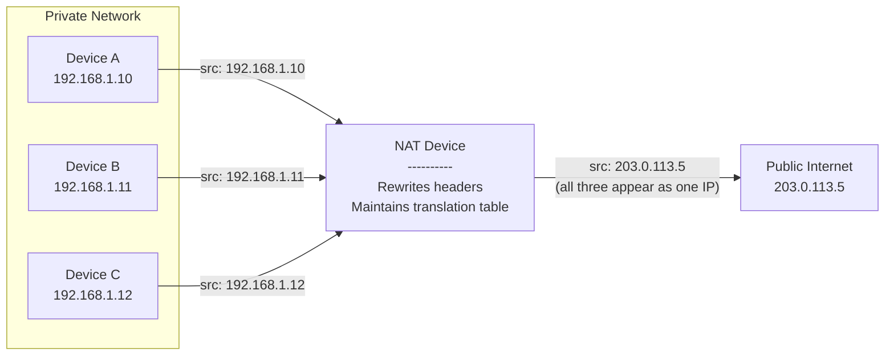

This gives us two things:

1. **Address conservation** - hundreds or thousands of devices share a handful of public IPs.
2. **A security side-effect** - devices behind NAT are not directly reachable from the outside, which isn't a firewall, but it acts like a crude one.

---

## The Types of NAT

NAT isn't a single thing. It's a family of techniques, and the differences between them matter a lot depending on whether you're running a home network, a data center, or a cloud platform.

---

### 1. Static NAT (One-to-One NAT)

**What it does:** Maps a single private IP to a single public IP. Permanently. No port translation involved.

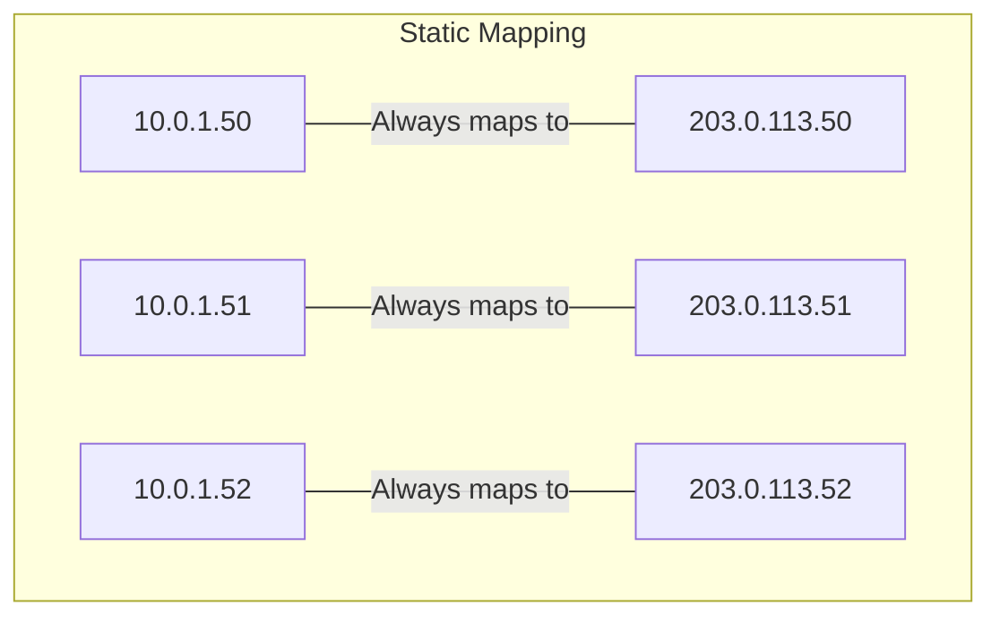

Every packet from `10.0.1.50` goes out as `203.0.113.50`, and every packet aimed at `203.0.113.50` gets forwarded to `10.0.1.50`. The mapping is fixed - it doesn't change, doesn't expire, doesn't depend on who initiates the connection.

**Where you see it:**

- Hosting a public-facing server (web server, mail server) behind a firewall.
- DMZ architectures where specific servers need stable, predictable public addresses.
- Regulatory environments where audit trails require a one-to-one mapping between internal and external identity.

**The trade-off:** You burn one public IP per internal host. This doesn't save you any addresses at all - it just gives you the ability to keep your internal addressing scheme private. That's a security and organizational benefit, not an address-conservation benefit.

**In practice:** If you've ever attached an Elastic IP to a cloud VM instance, that's static NAT. The cloud provider just doesn't call it that.

---

### 2. Dynamic NAT (Many-to-Many NAT)

**What it does:** Maps private IPs to public IPs from a **pool**, but still one-to-one at any given moment. The mapping is created on demand when a device initiates outbound traffic and released when the session ends (or times out).

```mermaid
flowchart LR
    subgraph Internal Hosts
        H1["10.0.1.50"]
        H2["10.0.1.51"]
        H3["10.0.1.52"]
        H4["10.0.1.53"]
    end

    subgraph NAT Pool
        direction TB
        IP1["203.0.113.10 assigned to .50"]
        IP2["203.0.113.11 assigned to .51"]
        IP3["203.0.113.12 assigned to .52"]
        IP4["203.0.113.13 available"]
    end

    H1 -.->|"dynamically assigned"| IP1
    H2 -.->|"dynamically assigned"| IP2
    H3 -.->|"dynamically assigned"| IP3
    H4 -.->|"waiting for free IP..."| NAT Pool
```

**Where you see it:**

- Mid-size networks with a block of public IPs but more internal hosts than public addresses.
- Legacy setups where applications couldn't handle port-based translation.

**The trade-off:** If you have 4 public IPs in the pool and 200 internal hosts, only 4 can be active simultaneously. Host number 5 gets dropped or queued. This is why dynamic NAT has been largely replaced by PAT in most real-world deployments.

**Honestly?** You don't see pure dynamic NAT much anymore. It made sense in the late '90s when public IPs were cheaper relative to demand and port translation was considered exotic. Today, PAT does the job better with fewer addresses.

---

### 3. PAT - Port Address Translation (Many-to-One NAT)

Also called **NAT overload** or **NAPT** (Network Address Port Translation). This is the NAT everyone actually uses.

**What it does:** Maps many private IPs to a **single** public IP (or a small handful) by rewriting both the IP address and the **source port number**. Each internal connection gets a unique combination of `public_IP:port`.

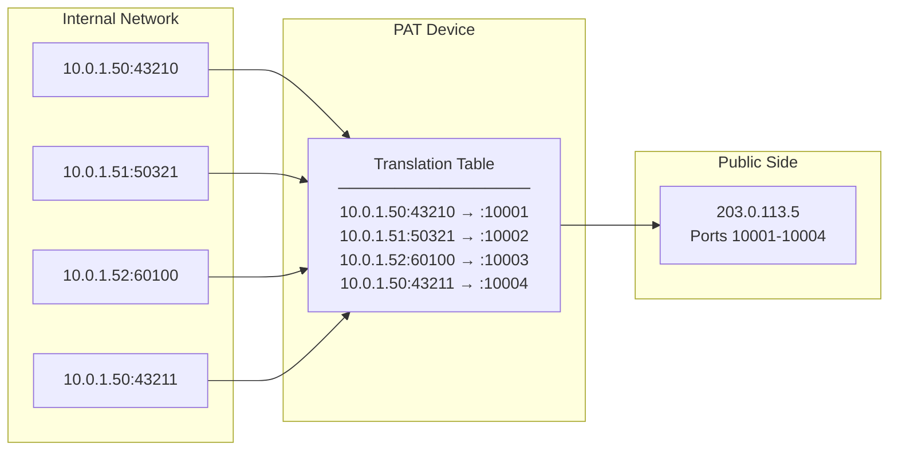

The NAT device maintains a **translation table** that tracks which internal `IP:port` maps to which external `IP:port`. When a response comes back to `203.0.113.5:10002`, the device looks up the table and forwards it to `10.0.1.51:50321`.

**Where you see it:**

- Your home router. Right now. This is how your ISP gives you one public IP and you run thirty devices behind it.
- Small to mid-size businesses.
- Any cloud VPC where instances in a private subnet talk to the internet through a NAT Gateway.

**The numbers:** A single public IP has roughly 65,535 usable ports. In theory, that's 65K simultaneous connections. In practice, most PAT implementations reserve ranges and handle edge cases, so you get maybe 30,000–50,000 concurrent sessions per IP. For a home network, that's absurd overkill. For a network with 5,000 users, you might need a pool of 3-4 public IPs behind PAT.

**This is the workhorse of the internet.** If someone says "NAT" without qualifying it further, they almost certainly mean PAT.

---

### 4. Carrier-Grade NAT (CGNAT / NAT444)

This is where things get interesting - and, depending on your perspective, depressing.

**What it does:** Your ISP performs NAT *again* on top of the NAT your home router is already doing. You end up with two layers of translation:

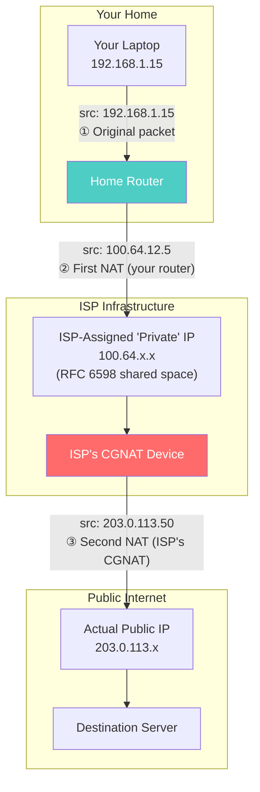

The `100.64.0.0/10` range (RFC 6598) was specifically allocated for CGNAT - it's a "shared address space" that's neither truly private nor truly public.

**Why ISPs do this:** Because they've run out of IPv4 addresses. Literally. ARIN (North America), RIPE (Europe), and APNIC (Asia-Pacific) have all exhausted their IPv4 pools. An ISP might have 50,000 customers but only 10,000 public IPv4 addresses. CGNAT lets them multiplex.

**Why this matters:**

- **No inbound connections.** You cannot host anything publicly from behind CGNAT without your ISP's cooperation. Port forwarding on your home router does nothing - the ISP's CGNAT has no idea about your port forward.
- **Shared IP reputation.** If someone on the same CGNAT public IP sends spam, *your* traffic gets flagged too. This breaks things like email deliverability and can trigger CAPTCHAs on services that rate-limit by IP.
- **WebRTC, VoIP, and P2P headaches.** NAT traversal is hard enough with one layer. Two layers makes STUN/TURN servers work overtime, and sometimes they just fail.
- **IP-based geolocation becomes unreliable.** One public IP might serve customers across a wide geographic area.
- **Logging and forensics.** Identifying a specific user behind CGNAT requires the ISP to log the full 5-tuple (src IP, src port, dst IP, dst port, protocol) with timestamps. Many ISPs don't retain this granularity.

**The Indian context specifically:** CGNAT is extremely common with Indian ISPs - Jio, Airtel broadband, ACT Fibernet, and most others use it aggressively. If you've ever wondered why you can't SSH into your home lab from outside without a VPN or tunnel, CGNAT is probably why.

---

### 5. Destination NAT (DNAT) / Port Forwarding

**What it does:** Rewrites the **destination** address (and optionally port) of incoming packets. This is the reverse direction - it's about making internal services reachable from outside.

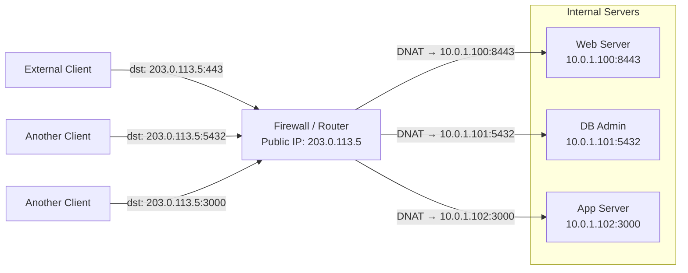

**Where you see it:**

- Port forwarding on your home router (forward port 8080 to your Raspberry Pi).
- Load balancers. Every cloud load balancer is essentially doing DNAT when it routes traffic to backend instances.
- `iptables`/`nftables` DNAT rules on Linux.
- Kubernetes `NodePort` and `LoadBalancer` services - these are DNAT in disguise.

**The Linux example you've probably written:**

```bash
# Forward port 80 on the host to port 8080 on an internal container
iptables -t nat -A PREROUTING -p tcp --dport 80 -j DNAT --to-destination 172.17.0.2:8080
iptables -t nat -A POSTROUTING -j MASQUERADE
```

If you run Docker, this is literally what Docker does behind the scenes when you publish a port with `-p 80:8080`.

---

### 6. Source NAT (SNAT)

**What it does:** Rewrites the **source** address of outgoing packets. This is the "classic" NAT direction.

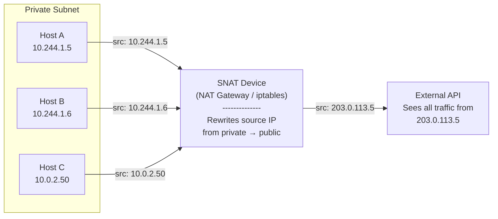

**Where you see it:**

- PAT is technically a form of SNAT (with port translation added).
- Cloud NAT Gateways (AWS NAT Gateway, GCP Cloud NAT) perform SNAT for instances in private subnets.
- Linux `MASQUERADE` target in iptables - this is dynamic SNAT where the source address is automatically set to the outgoing interface's IP.

```bash
# Classic Linux NAT: masquerade all traffic leaving eth0
iptables -t nat -A POSTROUTING -o eth0 -j MASQUERADE
```

**SNAT vs MASQUERADE in iptables:** `SNAT` requires you to specify the source IP explicitly - use it when your public IP is static. `MASQUERADE` auto-detects the outgoing interface's IP at packet time - use it when your IP is dynamic (DHCP, PPPoE). `MASQUERADE` is slightly slower because of the per-packet lookup, but the difference is negligible on modern hardware.

---

### 7. Hairpin NAT (NAT Loopback / NAT Reflection)

This is a niche but surprisingly common pain point.

**The problem:** You host a server at `10.0.1.100` behind NAT with a public IP of `203.0.113.5`. External clients reach it fine via `203.0.113.5`. But when an **internal** client at `10.0.1.50` tries to reach `203.0.113.5`, things break:

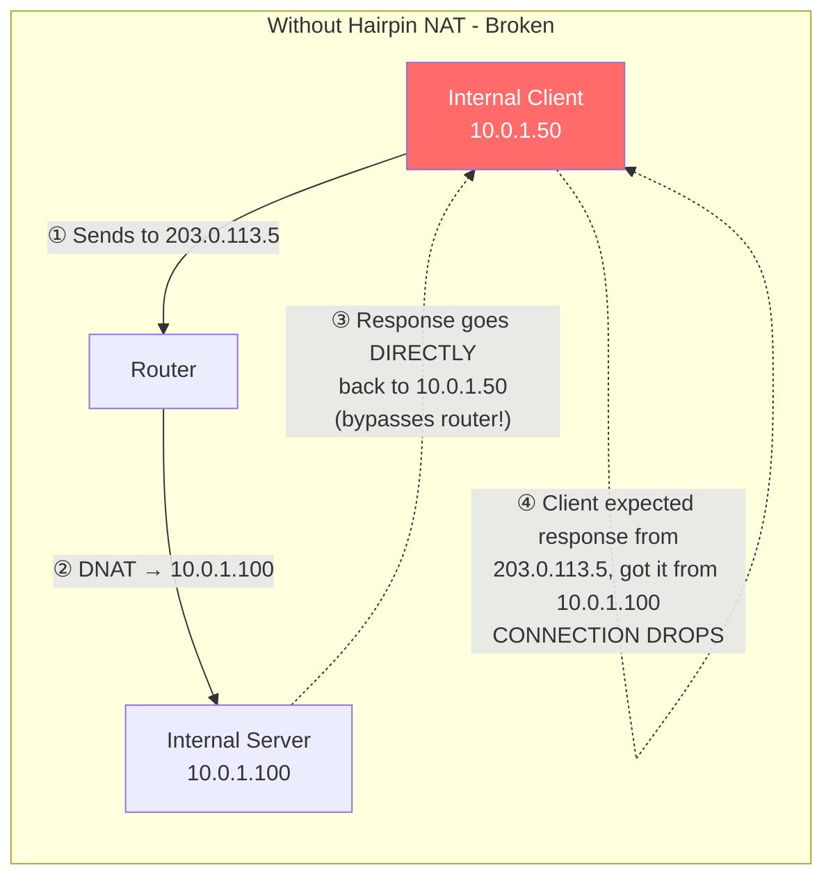

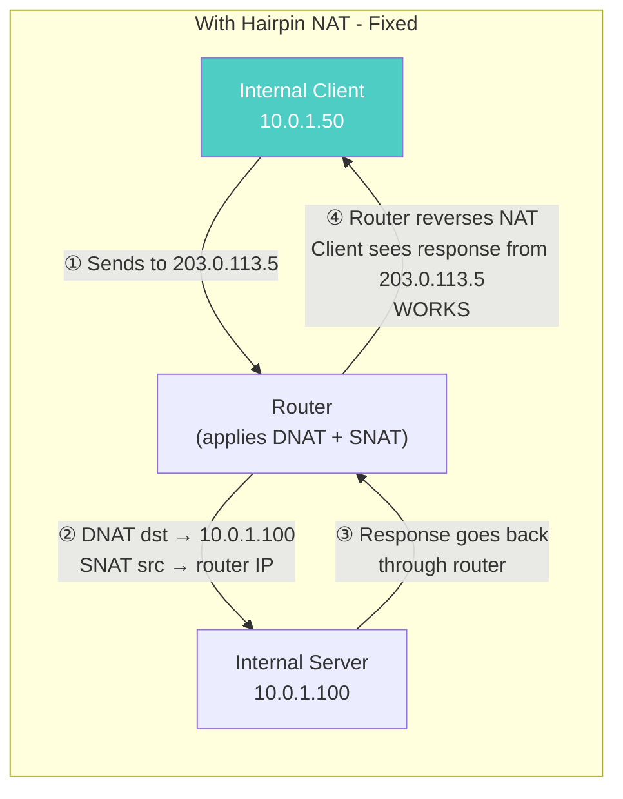

**Hairpin NAT fixes this** by applying both DNAT and SNAT to internal-to-internal traffic that hits the NAT device's public IP, so the return path goes back through the router.

**Where you see it:** Self-hosted setups where you access your own services by their public domain name from inside the same network. If you run something like Nextcloud or Gitea at home and use a domain name that resolves to your public IP, you need hairpin NAT or split-horizon DNS to make it work internally.

---

## The Complete NAT Family at a Glance

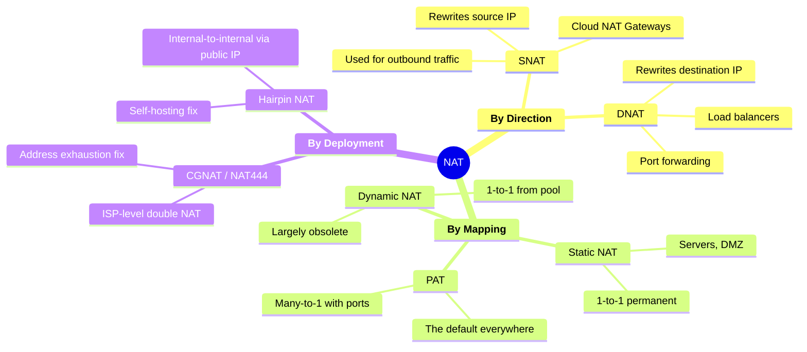

---

## NAT Traversal: The Hard Part

NAT fundamentally breaks the end-to-end principle of IP networking. Two devices behind different NATs cannot directly talk to each other without help. This is a big deal for VoIP and SIP (calls that fail to connect or have one-way audio), WebRTC (video calls, screen sharing, P2P data channels), online gaming (peer-to-peer multiplayer), VPNs (especially IPsec, which embeds IP addresses in the payload that NAT can't rewrite), and IoT (devices that need to be reachable from outside).

The solutions, in increasing order of complexity:

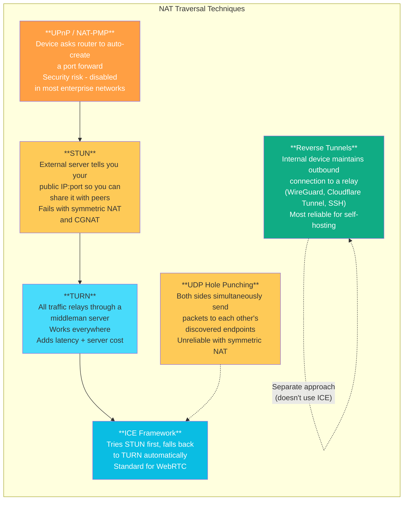

If you're behind CGNAT and need inbound connectivity, your realistic options are: **WireGuard/Tailscale VPN**, **Cloudflare Tunnel**, **SSH reverse tunnels**, or **asking your ISP for a static public IP** (some Indian ISPs offer this as a paid add-on on business plans).

---

## NAT Classification by Behavior (RFC 4787)

This matters for NAT traversal. Not all NATs behave the same way, and the behavior determines whether techniques like STUN and hole-punching will work.

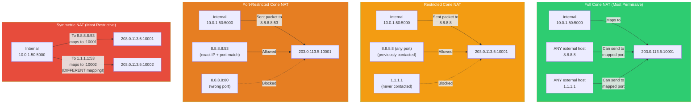

### Full Cone NAT (Endpoint-Independent Mapping)

Once an internal endpoint creates a mapping (`10.0.1.50:5000 → 203.0.113.5:10001`), **any** external host can send packets to `203.0.113.5:10001` and they'll be forwarded to `10.0.1.50:5000`. This is the most permissive type. STUN works perfectly. Hole punching works. P2P works. It's also the least secure - once a port is open, it's open to the world.

### Restricted Cone NAT (Address-Restricted)

The mapping exists, but the NAT only forwards incoming packets from an external IP that the internal host has **previously sent a packet to**. If `10.0.1.50` sent a packet to `8.8.8.8`, then `8.8.8.8` can send back to the mapped port. But `1.1.1.1` cannot - it hasn't been "authorized" by prior outbound traffic.

### Port-Restricted Cone NAT (Address + Port Restricted)

Same as restricted cone, but the restriction includes the **port**. If `10.0.1.50` sent to `8.8.8.8:53`, only `8.8.8.8:53` can send back. `8.8.8.8:80` is blocked. Most home routers implement this behavior.

### Symmetric NAT (Endpoint-Dependent Mapping)

The strictest type. A **different** external mapping is created for each unique destination. If `10.0.1.50:5000` talks to `8.8.8.8:53`, it might get mapped to `203.0.113.5:10001`. But if the same internal endpoint talks to `1.1.1.1:53`, it gets a **different** mapping - `203.0.113.5:10002`.

This breaks STUN, because the mapping discovered via the STUN server is useless for communicating with any other endpoint. Hole punching usually fails. You're forced into TURN relays.

**Where you see symmetric NAT:** Enterprise firewalls (Cisco ASA, Palo Alto, Fortinet), CGNAT deployments, and large corporate networks. It's the most secure NAT behavior, but the most hostile to P2P applications.

---

## NAT in Practice: Who Uses What

```mermaid
flowchart TB
    subgraph Home["Home Network"]
        direction TB
        Home_NAT["PAT\n(Port-Restricted Cone)"]
        Home_Why["One public IP shared by\nall household devices"]
    end

    subgraph ISP["ISP / Carrier"]
        direction TB
        ISP_NAT["CGNAT / NAT444\n(Symmetric or Port-Restricted)"]
        ISP_Why["50K customers sharing\n10K public IPs"]
    end

    subgraph Enterprise["Enterprise"]
        direction TB
        Ent_NAT["PAT + Static NAT for servers\n(Symmetric via firewall)"]
        Ent_Why["Security, auditability\ngranular control"]
    end

    subgraph Cloud["Cloud (AWS/GCP/Azure)"]
        direction TB
        Cloud_NAT["NAT Gateway (PAT)\n+ Elastic IP (Static NAT)"]
        Cloud_Why["Managed, auto-scaling\nprivate subnet egress"]
    end

    subgraph K8s["Kubernetes"]
        direction TB
        K8s_NAT["SNAT (pod egress)\nDNAT (services)"]
        K8s_Why["Pod networking abstraction\nservice discovery"]
    end

    subgraph Docker["Docker"]
        direction TB
        Docker_NAT["PAT + DNAT\n(port publishing)"]
        Docker_Why["Container isolation\nselective exposure"]
    end

    style Home fill:#dfe6e9,color:#2d3436
    style ISP fill:#fab1a0,color:#2d3436
    style Enterprise fill:#74b9ff,color:#2d3436
    style Cloud fill:#a29bfe,color:#2d3436
    style K8s fill:#55efc4,color:#2d3436
    style Docker fill:#81ecec,color:#2d3436
```

---

## NAT in Kubernetes and Containers: Where It Gets Layered

If you work with containers, you're dealing with NAT whether you realize it or not.

**Docker's default bridge network** creates a chain that looks like this:

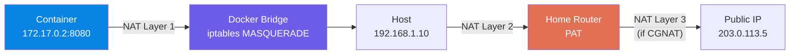

That's up to two (or three, with CGNAT) NAT layers for a single HTTP request from a container.

**Kubernetes adds more layers:**

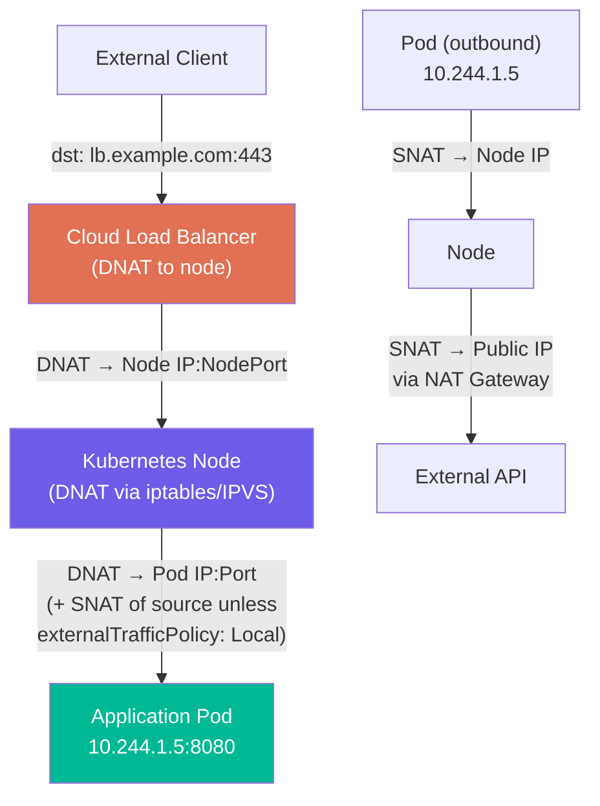

The `externalTrafficPolicy: Local` setting in Kubernetes exists specifically to **skip one SNAT hop** - it preserves the client's real IP by only routing to pods on the node that received the traffic.

If you've ever debugged why `X-Forwarded-For` headers show the wrong IP in a Kubernetes-hosted application, you've been bitten by this NAT chain.

---

## So Which NAT Is "Best"?

There's no universal best. It depends on what you're optimizing for.

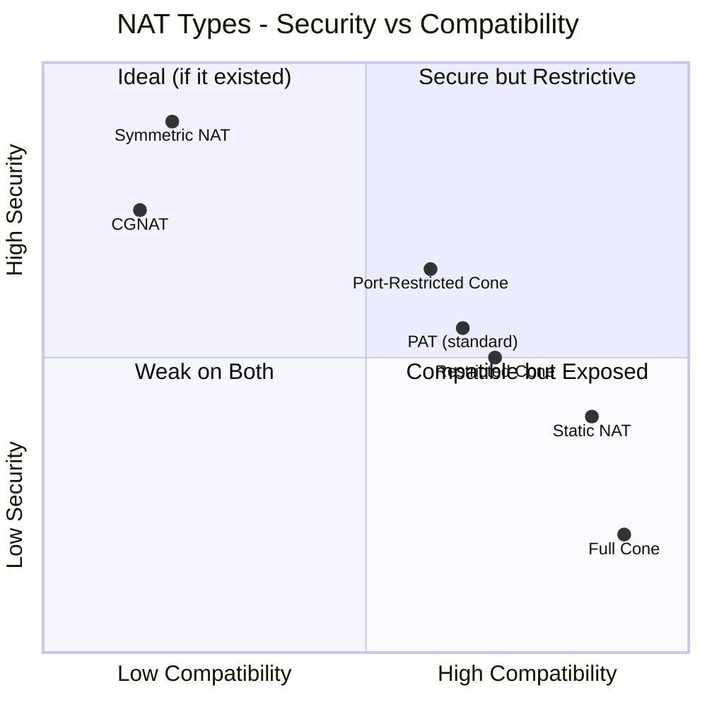

**If you want maximum address conservation:** CGNAT with PAT. One public IP can serve thousands of subscribers. ISPs love it for obvious economic reasons.

**If you want maximum security:** Symmetric NAT on an enterprise firewall. Each destination gets a unique mapping, making external probing nearly impossible. But your VoIP team will hate you.

**If you want maximum compatibility:** Full cone NAT. Everything works - P2P, gaming, VoIP, WebRTC. But you're essentially exposing mapped ports to the entire internet once they're active.

**If you want the pragmatic middle ground:** Port-restricted cone NAT (what most home routers do). It blocks unsolicited inbound traffic while allowing established connections to work normally. STUN works. Most applications work. Security is reasonable.

**For cloud-native workloads:** Managed NAT Gateways (PAT) for egress, with static/elastic IPs for services that need stable public addresses. Let the cloud provider handle the translation tables, scaling, and high availability.

---

## Common NAT Debugging Commands

A quick reference for when things go wrong:

```bash
# View current NAT/conntrack table on Linux
conntrack -L
cat /proc/net/nf_conntrack

# Watch NAT translations in real-time
conntrack -E

# Check iptables NAT rules
iptables -t nat -L -n -v

# See Docker's NAT rules specifically
iptables -t nat -L DOCKER -n -v

# Test what kind of NAT you're behind (install stun-client)
stun stun.l.google.com:19302

# Check if you're behind CGNAT (if your WAN IP is in 100.64.0.0/10)
curl -s ifconfig.me
# Compare with your router's WAN IP - if they differ, you're behind CGNAT

# Kubernetes: check service NAT rules (iptables mode)
iptables -t nat -L KUBE-SERVICES -n
```

---

## Closing Thoughts

NAT was supposed to be temporary. It became permanent infrastructure. Love it or hate it, if you're building anything that touches a network - and in 2025, that's everything - you need to understand it.

The key takeaways:

**PAT is the NAT that runs the internet.** Everything else is a variation for specific use cases.

**CGNAT is increasingly the norm**, especially in markets like India and across mobile networks globally. Design your applications assuming you won't have a public IP.

**NAT behavior classification matters** the moment you need peer-to-peer connectivity. Know whether you're behind symmetric NAT before you promise your users real-time video calls will "just work."

**In cloud and container environments**, NAT is abstracted but very much present. Understanding the underlying translation chain saves hours of debugging.

**IPv6 eliminates the need for NAT** entirely by giving every device a globally routable address. But until IPv6 adoption is truly universal, NAT isn't going anywhere.

Build with NAT in mind. Test behind NAT. And when something breaks at 2 AM, check the translation table first.

---

*This article reflects practical experience with enterprise, ISP, and cloud networking environments. The opinions on CGNAT are personal and only slightly bitter.*
