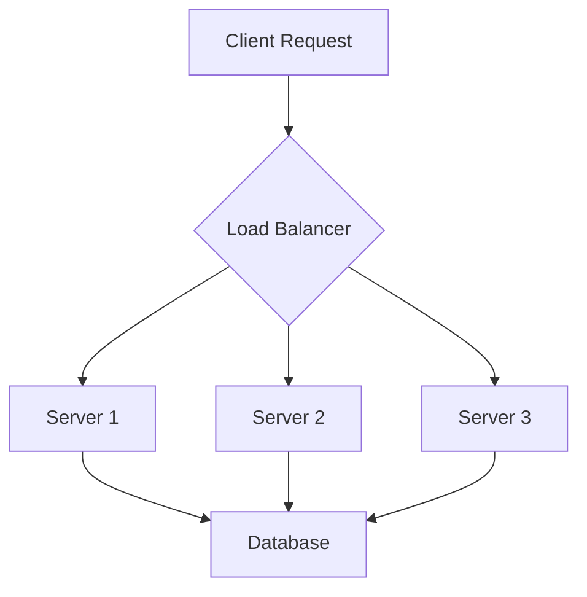

# Comprehensive Stress Test Document

This document tests **all features** together with *realistic content* to measure rendering performance.

---

## Table of Contents

1. [Code Blocks](#code-blocks)
2. [Tables](#tables)
3. [Nested Structures](#nested-structures)
4. [Inline Formatting](#inline-formatting)

---

## Code Blocks

### Rust Example

```rust
use std::collections::HashMap;
use std::sync::{Arc, Mutex};
use tokio::sync::mpsc;

#[derive(Debug, Clone)]
pub struct Config {
    pub database_url: String,
    pub max_connections: u32,
    pub timeout_seconds: u64,
    pub retry_policy: RetryPolicy,
}

#[derive(Debug, Clone)]
pub enum RetryPolicy {
    None,
    Fixed { delay_ms: u64, max_retries: u32 },
    Exponential { base_ms: u64, max_retries: u32, max_delay_ms: u64 },
}

impl Config {
    pub fn from_env() -> Result<Self, ConfigError> {
        let database_url = std::env::var("DATABASE_URL")
            .map_err(|_| ConfigError::MissingVar("DATABASE_URL"))?;

        let max_connections = std::env::var("MAX_CONNECTIONS")
            .unwrap_or_else(|_| "10".to_string())
            .parse()
            .map_err(|_| ConfigError::InvalidValue("MAX_CONNECTIONS"))?;

        Ok(Config {
            database_url,
            max_connections,
            timeout_seconds: 30,
            retry_policy: RetryPolicy::Exponential {
                base_ms: 100,
                max_retries: 5,
                max_delay_ms: 30000,
            },
        })
    }
}

pub async fn run_server(config: Config) -> Result<(), Box<dyn std::error::Error>> {
    let (tx, mut rx) = mpsc::channel(100);
    let state = Arc::new(Mutex::new(HashMap::new()));

    tokio::spawn(async move {
        while let Some(msg) = rx.recv().await {
            println!("Received: {:?}", msg);
        }
    });

    println!("Server running with {} max connections", config.max_connections);
    Ok(())
}
```

### JavaScript Example

```javascript
class EventEmitter {
  constructor() {
    this.listeners = new Map();
    this.maxListeners = 10;
  }

  on(event, callback, options = {}) {
    if (!this.listeners.has(event)) {
      this.listeners.set(event, []);
    }

    const listeners = this.listeners.get(event);
    if (listeners.length >= this.maxListeners) {
      console.warn(`MaxListenersExceeded: ${event} has ${listeners.length} listeners`);
    }

    listeners.push({
      callback,
      once: options.once || false,
      priority: options.priority || 0,
    });

    listeners.sort((a, b) => b.priority - a.priority);
    return this;
  }

  emit(event, ...args) {
    const listeners = this.listeners.get(event);
    if (!listeners) return false;

    const toRemove = [];
    for (const listener of listeners) {
      try {
        listener.callback.apply(this, args);
        if (listener.once) toRemove.push(listener);
      } catch (error) {
        this.emit('error', error);
      }
    }

    toRemove.forEach(l => {
      const idx = listeners.indexOf(l);
      if (idx !== -1) listeners.splice(idx, 1);
    });

    return true;
  }
}

const emitter = new EventEmitter();
emitter.on('data', (payload) => {
  console.log('Received:', JSON.stringify(payload, null, 2));
});
```

### Python Example

```python
import asyncio
from dataclasses import dataclass, field
from typing import Optional, List, Dict, Any
from contextlib import asynccontextmanager

@dataclass
class DatabaseConfig:
    host: str = "localhost"
    port: int = 5432
    database: str = "myapp"
    username: str = "postgres"
    password: str = ""
    pool_size: int = 10
    ssl: bool = False
    options: Dict[str, Any] = field(default_factory=dict)

class ConnectionPool:
    def __init__(self, config: DatabaseConfig):
        self.config = config
        self._connections: List[Any] = []
        self._available: asyncio.Queue = asyncio.Queue()
        self._lock = asyncio.Lock()

    async def initialize(self):
        async with self._lock:
            for _ in range(self.config.pool_size):
                conn = await self._create_connection()
                self._connections.append(conn)
                await self._available.put(conn)

    @asynccontextmanager
    async def acquire(self):
        conn = await self._available.get()
        try:
            yield conn
        finally:
            await self._available.put(conn)

    async def _create_connection(self):
        return await asyncio.open_connection(
            self.config.host,
            self.config.port,
            ssl=self.config.ssl,
        )

async def main():
    config = DatabaseConfig(
        host="db.example.com",
        port=5432,
        database="production",
        pool_size=20,
        ssl=True,
    )
    pool = ConnectionPool(config)
    await pool.initialize()

    async with pool.acquire() as conn:
        print(f"Connected: {conn}")

if __name__ == "__main__":
    asyncio.run(main())
```

### Shell Script

```bash
#!/usr/bin/env bash
set -euo pipefail

readonly SCRIPT_DIR="$(cd "$(dirname "${BASH_SOURCE[0]}")" && pwd)"
readonly LOG_FILE="/var/log/deploy.log"

log() {
    echo "[$(date '+%Y-%m-%d %H:%M:%S')] $*" | tee -a "$LOG_FILE"
}

check_dependencies() {
    local deps=("docker" "kubectl" "helm" "jq")
    for dep in "${deps[@]}"; do
        if ! command -v "$dep" &>/dev/null; then
            log "ERROR: Missing dependency: $dep"
            exit 1
        fi
    done
    log "All dependencies satisfied"
}

deploy() {
    local environment="$1"
    local version="$2"

    log "Deploying version $version to $environment"

    docker build -t "myapp:$version" "$SCRIPT_DIR" \
        --build-arg VERSION="$version" \
        --build-arg ENV="$environment"

    helm upgrade --install myapp ./charts/myapp \
        --namespace "$environment" \
        --set image.tag="$version" \
        --set environment="$environment" \
        --wait --timeout 300s

    log "Deployment complete"
}

main() {
    check_dependencies
    deploy "${1:-staging}" "${2:-latest}"
}

main "$@"
```

---

## Tables

### Performance Metrics

| Metric | Baseline | After Optimization | Improvement | Notes |
|--------|----------|-------------------|-------------|-------|
| Startup Time | 2.3s | 0.8s | 65% faster | Lazy loading implemented |
| Memory Usage | 512MB | 128MB | 75% reduction | Object pooling added |
| Request Latency (p50) | 45ms | 12ms | 73% faster | Connection reuse |
| Request Latency (p99) | 890ms | 120ms | 86% faster | Query optimization |
| Throughput | 1,200 req/s | 8,500 req/s | 7x increase | Async processing |
| Error Rate | 2.1% | 0.03% | 98.6% reduction | Circuit breaker pattern |
| CPU Usage (avg) | 78% | 23% | 70% reduction | Algorithm improvements |
| Disk I/O | 450 MB/s | 120 MB/s | 73% reduction | Write batching |

### API Endpoints

| Method | Path | Auth | Rate Limit | Description |
|--------|------|------|------------|-------------|
| GET | /api/v2/users | Bearer Token | 100/min | List all users with pagination support and filtering |
| POST | /api/v2/users | Bearer Token | 20/min | Create a new user account with validation |
| GET | /api/v2/users/:id | Bearer Token | 200/min | Get user details by ID |
| PUT | /api/v2/users/:id | Bearer Token | 50/min | Update user profile information |
| DELETE | /api/v2/users/:id | Admin Token | 10/min | Soft delete a user account |
| GET | /api/v2/users/:id/posts | Bearer Token | 100/min | List user's posts with comments |
| POST | /api/v2/auth/login | None | 5/min | Authenticate and receive JWT tokens |
| POST | /api/v2/auth/refresh | Refresh Token | 30/min | Refresh an expired access token |
| GET | /api/v2/health | None | 1000/min | Health check endpoint for monitoring |
| GET | /api/v2/metrics | Admin Token | 60/min | Prometheus-compatible metrics export |

### Unicode Table

| Language | Greeting | Script |
|----------|----------|--------|
| English | Hello, World! | Latin |
| Japanese | こんにちは世界 | Kanji/Hiragana |
| Chinese | 你好世界 | Hanzi |
| Korean | 안녕하세요 세계 | Hangul |
| Arabic | مرحبا بالعالم | Arabic |
| Russian | Привет мир | Cyrillic |
| Hindi | नमस्ते दुनिया | Devanagari |
| Thai | สวัสดีชาวโลก | Thai |

---

## Nested Structures

### Deep Blockquotes

> First level blockquote with some introductory text that explains the context.
>
> > Second level with a more specific point about the topic at hand.
> >
> > > Third level with a very detailed observation that requires careful consideration and thought.
> > >
> > > This continues on the third level with additional details.
> >
> > Back to second level with a summary.
>
> Back to first level with closing thoughts.

### Nested Lists

- **Architecture Patterns**
  - Monolithic
    - Advantages: Simple deployment, easy debugging
    - Disadvantages: Scaling limitations, tight coupling
  - Microservices
    - Advantages: Independent scaling, technology diversity
    - Disadvantages: Distributed complexity, network overhead
    - Service Mesh Options
      1. Istio
      2. Linkerd
      3. Consul Connect
  - Serverless
    - Advantages: No infrastructure management, pay-per-use
    - Disadvantages: Cold starts, vendor lock-in
- **Database Choices**
  1. Relational (PostgreSQL, MySQL)
     - [x] ACID compliance
     - [x] Complex queries
     - [ ] Horizontal scaling (limited)
  2. Document (MongoDB, CouchDB)
     - [x] Flexible schema
     - [x] Horizontal scaling
     - [ ] Complex joins
  3. Key-Value (Redis, DynamoDB)
     - [x] Ultra-fast reads
     - [x] Simple data model
     - [ ] Complex queries

---

## Inline Formatting

This paragraph contains **bold text**, *italic text*, ***bold italic text***, `inline code`, and ~~strikethrough text~~. It also has [a link](https://example.com) and .

Here's a paragraph with a footnote reference[^1] and another[^2].

[^1]: This is the first footnote with detailed explanation about the referenced topic.
[^2]: This is the second footnote providing additional context and references.

---

## Alerts

> [!NOTE]
> This is a note alert with important information that the reader should be aware of.

> [!TIP]
> This is a tip alert with helpful suggestions for better usage of the tool.

> [!IMPORTANT]
> This is an important alert that highlights critical information.

> [!WARNING]
> This is a warning alert about potential issues or dangerous operations.

> [!CAUTION]
> This is a caution alert about irreversible actions or data loss risks.

---

## Mermaid Diagrams



---

## Long Paragraphs for Wrapping Test

Lorem ipsum dolor sit amet, consectetur adipiscing elit. Sed do eiusmod tempor incididunt ut labore et dolore magna aliqua. Ut enim ad minim veniam, quis nostrud exercitation ullamco laboris nisi ut aliquip ex ea commodo consequat. Duis aute irure dolor in reprehenderit in voluptate velit esse cillum dolore eu fugiat nulla pariatur. Excepteur sint occaecat cupidatat non proident, sunt in culpa qui officia deserunt mollit anim id est laborum.

Curabitur pretium tincidunt lacus. Nulla gravida orci a odio. Nullam varius, turpis et commodo pharetra, est eros bibendum elit, nec luctus magna felis sollicitudin mauris. Integer in mauris eu nibh euismod gravida. Duis ac tellus et risus vulputate vehicula. Donec lobortis risus a elit. Etiam tempor. Ut ullamcorper, ligula ut dictum pharetra, nisi nunc fringilla magna, in commodo elit erat nec turpis. Ut pharetra augue nec augue.

---

*End of stress test document.*
