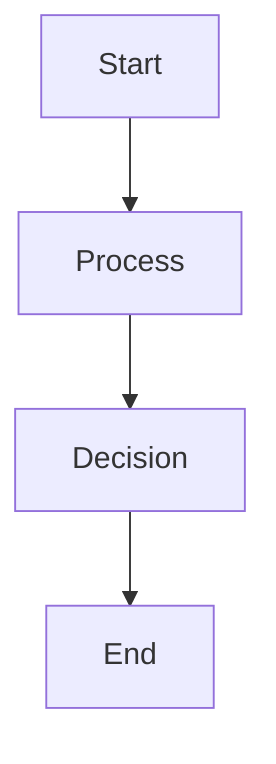

# Welcome to MD

This is a **terminal markdown renderer** written in Rust. It supports _italic_, **bold**, ~~strikethrough~~, and `inline code`.

## Features

Here's what it can do:

### Text Formatting

You can combine **bold and _italic_** text together. Links work too: [Rust](https://www.rust-lang.org) and images show as .

### Lists

Unordered list:

- First item
- Second item with **bold**
  - Nested item
  - Another nested
    - Deep nested
- Third item

Ordered list:

1. Step one
2. Step two
3. Step three

Task list:

- [x] Completed task
- [ ] Incomplete task
- [x] Another done task

### Blockquotes

> This is a blockquote.
> It can span multiple lines.
>
> > And it can be nested too!

### Code

Inline code: `println!("Hello, world!")`.

```rust
fn main() {
    let name = "world";
    println!("Hello, {}!", name);

    for i in 0..5 {
        println!("Count: {}", i);
    }
}
```

```python
def greet(name: str) -> str:
    return f"Hello, {name}!"

if __name__ == "__main__":
    print(greet("world"))
```

### Tables

| Feature | Status | Notes |
|---------|:------:|------:|
| Headings | Done | All 6 levels |
| Lists | Done | Nested + tasks |
| Code | Done | Syntax highlight |
| Tables | Done | With alignment |

### Horizontal Rule

---

### Alerts

> [!NOTE]
> This is an informational note.

> [!WARNING]
> Be careful with this operation.

> [!IMPORTANT]
> Critical information here.

#### H4 Heading

##### H5 Heading

###### H6 Heading

### Mermaid Diagram



That's all the features! Check out the [GitHub repo](https://github.com/example/md) for more.

---

*Footnote example[^1]*

[^1]: This is a footnote.
